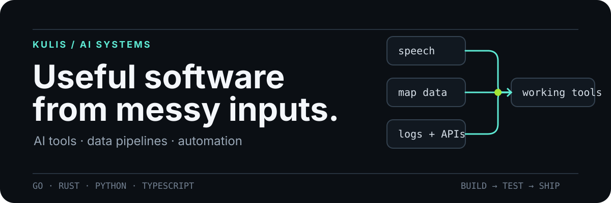

  

  I turn messy inputs—speech, map listings, logs, and APIs—into useful software.

## Selected work

### [Maps Scraper — Google, Yandex Maps & 2GIS](https://github.com/kulisML/yandex-2gis-maps-scraper)

A Go-based business-data pipeline with three map providers, grid search, deduplication, contact enrichment, CSV/JSON export, CLI, and Web UI. Extends `gosom/google-maps-scraper` with Yandex Maps and 2GIS providers.

`Go` · `Playwright` · `REST API` · `data enrichment`

### [Handy LLM Post-Processing](https://github.com/kulisML/handy-llm-postprocessing)

An unofficial Handy extension that runs local speech transcription through an automatic LLM editing step before pasting the result. Supports OpenRouter and local OpenAI-compatible servers such as Ollama and LM Studio.

`Rust` · `Tauri` · `speech-to-text` · `local LLM`

### [Token Economy](https://github.com/kulisML/economy-tokens-pepe)

A Codex and Claude Code plugin for reducing wasted context: filter noisy test output, query large logs, avoid generated-file dumps, and route bulky prompts through cheaper representations. Includes reproducible local benchmarks and focused agent skills.

`PowerShell` · `Codex` · `Claude Code` · `developer tooling`

### [KOD+ 2027 Infra Arena](https://github.com/kulisML/-------)

A full-stack hackathon platform with an animated Three.js interface, registration, team formation, tournament tables, admin workflows, PostgreSQL persistence, Docker deployment, and automated tests.

`React` · `Three.js` · `Express` · `Prisma` · `PostgreSQL`

## Working set

`Go` · `Rust` · `Python` · `TypeScript` · `FastAPI` · `React` · `Docker` · `PostgreSQL`

I am currently focused on local AI tooling, automation systems, data collection, and product-ready full-stack applications.

## Contact

[Telegram](https://t.me/kulissssss) · [Email](mailto:kulismlengineer107@gmail.com)
