<div align="center">
  

  <h1>kulissssss / kulisML</h1>

  <p>
    <strong>AI Full-Stack Developer building intelligent web products</strong><br/>
    <span>Aspiring Machine Learning Engineer focused on automation, product thinking, and polished user experience.</span>
  </p>

  

  <br/>
  <br/>

  <a href="https://t.me/kulissssss">
    
  </a>
  <a href="mailto:kulismlengineer107@gmail.com">
    
  </a>
  
</div>

---

## About

I am Kulis, an aspiring Machine Learning Engineer building my path through real projects in AI, automation, backend systems, and modern web interfaces.

I like products that feel intelligent, useful, and sharp: bots that connect workflows, ML tools that turn raw data into decisions, and interfaces that make complex systems easier to use.

```txt
Current signal: AI + ML foundations + full-stack delivery + frontend polish
Main direction: intelligent web products, automation systems, and applied ML
```

## Core Pillars

| AI / ML | Full-Stack Systems | Frontend Craft |
| --- | --- | --- |
| Python, ML foundations, model experiments, data workflows, OpenAI API, LangChain | FastAPI, Node.js, TypeScript, APIs, bots, databases, Docker-ready architecture | React, Next.js, responsive UI, animation, clean product surfaces |

## Tech Stack

<div align="center">

### AI / ML


### Full-Stack


### Frontend Craft


</div>

## Featured Projects

These are the first signals I want clients and recruiters to see.

| Project | Why it matters |
| --- | --- |
| [gitlab-telegram](https://github.com/kulisML/gitlab-telegram) | GitLab to Telegram automation with FastAPI, aiogram, SQLite, webhooks, daily reports, and team notifications. |
| [bulbai2](https://github.com/kulisML/bulbai2) | Python desktop engineering tool for STL-first bulbous bow generation, evaluation, and report export. |
| [FocusGuard](https://github.com/kulisML/FocusGuard) | Python project lab for focus/productivity tooling and local application experiments. |
| [HakatonHungerGames](https://github.com/kulisML/HakatonHungerGames) | Hackathon-style TypeScript project with Python pieces and product-building practice. |

<div align="center">
  <a href="https://github.com/kulisML/gitlab-telegram">
    
  </a>
  <a href="https://github.com/kulisML/bulbai2">
    
  </a>
  <a href="https://github.com/kulisML/FocusGuard">
    
  </a>
  <a href="https://github.com/kulisML/HakatonHungerGames">
    
  </a>
</div>

## Project Galaxy

I keep the strongest projects above, and keep the rest visible here as learning labs, hackathon builds, and experiments.

| Repository | Signal | Stack |
| --- | --- | --- |
| [gitlab-telegram](https://github.com/kulisML/gitlab-telegram) | Automation, bots, webhooks, backend architecture | Python, FastAPI, aiogram, SQLite |
| [bulbai2](https://github.com/kulisML/bulbai2) | Engineering tooling, desktop workflow, reports | Python |
| [FocusGuard](https://github.com/kulisML/FocusGuard) | Productivity/tooling experiment | Python |
| [HakatonHungerGames](https://github.com/kulisML/HakatonHungerGames) | Hackathon product build | TypeScript, Python, CSS |
| [hakanot4](https://github.com/kulisML/hakanot4) | Forked TypeScript project and collaboration trace | TypeScript |
| [RabittMQ-Calary](https://github.com/kulisML/RabittMQ-Calary) | Backend and messaging practice | Python |
| [Razum2.0-HAC](https://github.com/kulisML/Razum2.0-HAC) | Hackathon/frontend product practice | TypeScript |
| [-------](https://github.com/kulisML/-------) | Recent Python lab | Python |
| [-----------](https://github.com/kulisML/-----------) | MCP / TypeScript experiment | TypeScript |
| [Click](https://github.com/kulisML/Click) | Browser or UI interaction experiment | JavaScript |
| [KulisMLbot](https://github.com/kulisML/KulisMLbot) | Bot-building practice | Python |
| [gut](https://github.com/kulisML/gut) | HTML/web experiment | HTML |
| [fsdf](https://github.com/kulisML/fsdf) | Scratch learning repository | Lab |
| [mm3](https://github.com/kulisML/mm3) | HTML/web experiment | HTML |

## GitHub Signal

<div align="center">
  
  
</div>

<div align="center">
  
</div>

## Contribution Snake

<div align="center">
  <picture>
    <source media="(prefers-color-scheme: dark)" srcset="https://raw.githubusercontent.com/kulisML/kulisML/output/github-contribution-grid-snake-dark.svg" />
    <source media="(prefers-color-scheme: light)" srcset="https://raw.githubusercontent.com/kulisML/kulisML/output/github-contribution-grid-snake.svg" />
    
  </picture>
</div>

## Now Building

- Deeper ML engineering fundamentals through Python projects and experiments.
- Automation systems that connect APIs, bots, notifications, and team workflows.
- Full-stack products where the backend is useful and the interface feels clean.
- A stronger public portfolio around AI-powered tools and applied machine learning.

## Contact

If you want to build something intelligent, automated, or beautifully practical:

- Telegram: [@kulissssss](https://t.me/kulissssss)
- Email: [kulismlengineer107@gmail.com](mailto:kulismlengineer107@gmail.com)

<div align="center">
  <strong>Building the future one practical AI product at a time.</strong>
</div>
